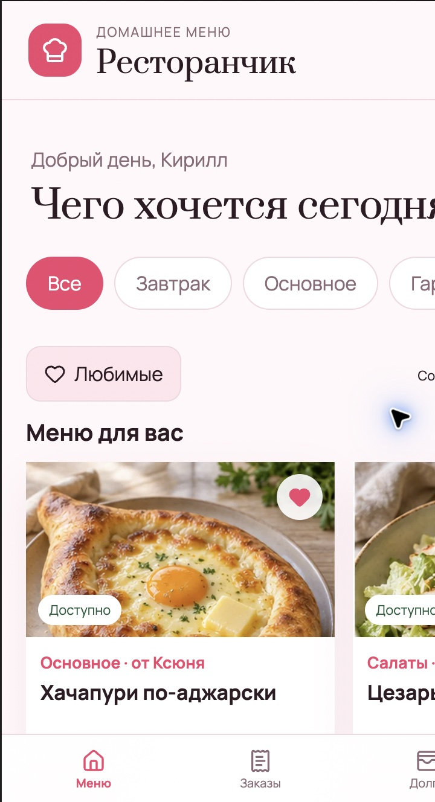

# Ресторанчик

Мобильное веб-приложение «домашний ресторан» для двоих. Каждый добавляет свои блюда, назначает цены в поцелуях, комплиментах и других домашних валютах, а второй может собрать и отправить заказ.

## Интерфейс

| На компьютере | На iPhone |
| --- | --- |
|  |

> На скриншотах показано реальное домашнее меню. Сама база, загруженные фотографии, заказы, отзывы, долги и Telegram-токен в репозиторий не входят.

## Что умеет

- личные и общие блюда с фото, составом, категорией и доступностью;
- своя цена, время готовки, вариации и дополнения у каждого повара;
- корзина и заказы со статусами без ручного обновления страницы;
- отзывы, рейтинги и фото готовых блюд;
- долги по каждой валюте и подтверждаемая оплата;
- «Наш холодильник» с отметками «есть», «мало» и «нет»;
- Telegram-уведомления, звуковые сигналы, темы и резервные копии.

## Запуск

Нужен Node.js 22.13 или новее.

```bash
npm install
npm run build
RESTAURANT_KIRILL_PASSWORD='change-this' \
RESTAURANT_KSYUNYA_PASSWORD='change-this-too' \
npm start
```

После запуска сайт доступен по адресу `http://localhost:3030`. Для входа с телефона откройте `http://IP-адрес-Mac:3030` в той же Wi-Fi-сети.

Пароли из переменных окружения используются только при первом создании базы. Все локальные данные создаются в папке `data/`, которая исключена из Git.

## Автозапуск на macOS

После `npm install` и `npm run build` запустите `install-macos.command`. LaunchAgent будет запускать «Ресторанчик» при входе в macOS и перезапускать его после сбоя.

## Telegram

В разделе «Ещё» один из пользователей сохраняет токен бота. Затем каждый отдельно нажимает «Подключить мой Telegram» и отправляет боту одноразовый код. Токен хранится только в локальной SQLite-базе.

## Проверка

```bash
npm run check
```
